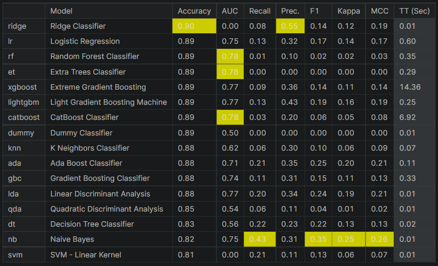

# Machine-learning : Death Prediction Rate 

This group project was developped in 2021 @EPITA engineering school to get familiar with:
* EDA : data exploratory analysis of structured data using pandas library
* Visualization with seaborn and matplotlib.pyplot
* Machine-Learning libraries in Python with scikit-learn.

## Introduction

The goal of this project is to predict the death rate of patients after admission in Intensive Care Unit.

## Files

### Notebook
The code and the results can be found in the notebook : deathpredict.ipynb
### Report
* The report of this project can be found under the name of DeathPredict_Report.pdf It was written in latex and compiled in pdf using overleaf.
* The report can also be found in MarkDown format : report.md

## Context

The predictors of in-hospital mortality for intensive care units (ICU)-admitted HF (Heart Failure) patients remain poorly characterized. That is why it is important for doctors to know if a patient should receive extra help from the staff and if a special attention should be put in place to monitorize patient evolution in time.
Therefore , the use of a ML algorithm would be useful for helping the medical staff make an informed decision. The explainability of the model is crucial in this case so the doctor knows what made the algorithm predict the outcome (death or survival)

## Quick Results to visualize

## Data

The Initial data can be found on Kaggle : https://www.kaggle.com/saurabhshahane/in-hospital-mortality-prediction.
The data come under an Excel (csv ) file containing 51 columns for each of the 1177 patients.

## Existing Study

The existing study can be found here : https://datadryad.org/stash/dataset/doi:10.5061/dryad.0p2ngf1zd

## Data Source

The MIMIC-III database (version 1.4, 2016) is a publicly available critical care database containing de-identified data on 46,520 patients and 58,976 admissions to the ICU of the Beth Israel Deaconess Medical Center, Boston, USA, between 1 June, 2001 and 31 October, 2012. These data include comprehensive information, such as demographics, admitting notes, International Classification of Diseases-9th revision (ICD-9) diagnoses, laboratory tests, medications, procedures, fluid balance, discharge summaries, vital sign measurements undertaken at the bedside, caregivers notes, radiology reports, and survival data12. After successful completion of the National Institutes of Health Protecting Human Research Participants web-based training course, we obtained approval to extract data from MIMIC-III for research purposes (Certification Number: 28860101).
